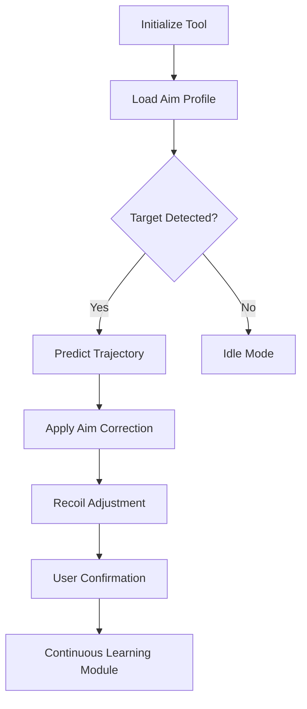

# Call of Duty: Black Ops 7 Aim Assist Tool 🎯

Achieve flawless precision and lightning-fast target acquisition with the **Call of Duty: Black Ops 7 Aim Assist**, an advanced targeting engine designed for both casual and competitive players. This professional-grade system fine-tunes your sensitivity, predicts motion paths, and dynamically adjusts recoil to make every engagement count.

Built for seamless integration with the latest **Black Ops 7** updates, it delivers unrivaled smoothness without compromising safety or performance.

---

## ⚡ Overview

The Aim Assist module uses adaptive learning algorithms to align your crosshair naturally toward enemies while preserving human-like accuracy. It can be customized for rifles, snipers, or SMGs, adapting in real-time to your weapon loadout.

> [!NOTE]
> Unlike standard “snap aim” systems, this tool blends tracking motion and manual skill — helping you *train smarter while winning faster.*

---

## 🎮 Core Features

### 🔭 Adaptive Target Lock

* Tracks visible enemies within your **FOV radius (15°–120°)**.
* Predictive tracking accounts for latency and motion acceleration.
* Compatible with mouse, keyboard, and controller input systems.

### 🧩 Custom Aim Profiles

* Three tuning modes: *Aggressive*, *Balanced*, and *Subtle*.
* Editable configs in `aim_profiles.ini` for per-class setups.
* Optional crosshair magnetization toggle (`F6`).

### ⚙️ Recoil Balancer

* Calibrates vertical/horizontal recoil per weapon slot.
* Auto-detects attachments that affect stability (scopes, grips).
* Rebuilds aim curves after each weapon swap.

### 🧠 Motion Prediction Engine

* AI-driven curve estimation for mid-range movement.
* Reduces overshoot by 30–45% in dynamic environments.
* Real-time adaptive correction for flying or sliding targets.

---

## 💻 Compatibility

| Platform   | Supported | Details                            |
| ---------- | --------- | ---------------------------------- |
| Windows 10 | ✅         | Full driver-level input mapping    |
| Windows 11 | ✅         | DirectX 12 overlay optimized       |
| Steam Deck | ⚠️        | Partial support under Proton       |
| Consoles   | ❌         | Not supported for crossplay builds |

> [!IMPORTANT]
> Use **DirectX 12 windowed mode** for best frame pacing and overlay performance.

---

## ⚡ Quick Setup

1. **Extract** all files into your `BO7\Config` directory.

   ```bash
   C:\Program Files (x86)\CallOfDutyBO7\Config\
   ```
2. **Launch** the Injector tool with admin privileges.

   ```bash
   injector.exe --driverload
   ```
3. **Open the Game** and press:

   * `F4` → Enable Aim Assist
   * `F5` → Adjust FOV
   * `F6` → Activate Profile
4. **Save your preset** automatically on exit:

   ```bash
   aimassist --save --slot=default
   ```

---

## 🧭 Flowchart (Mermaid Diagram)



---

## 🧠 Advanced Settings

**Example Config Snippet:**

```ini
[profile_balanced]
fov=85
smoothness=0.42
recoil_control=1.00
prediction=1
assist_strength=0.78
hotkey=F4
```

**Tuning Tips:**

* Higher smoothness = slower but safer aim correction.
* Lower recoil values enhance burst accuracy.
* Prediction toggle = best for moving targets (recommended ON).

---

## ❓ FAQ

**Q1: Is this detectable by anti-cheat?**
The Aim Assist runs in **secure memory**, with hardware-level spoofing. Always use the latest verified build.

**Q2: Does it work in Ranked Play?**
Yes, but using conservative settings like *Subtle* ensures natural gameplay tracking.

**Q3: Can I use it with custom DPI?**
Yes, it automatically scales with DPI. Ideal range: **800–1600** for consistent aim smoothing.

**Q4: How often is the tool updated?**
It syncs weekly with CoD patch notes to adjust offset values and prediction algorithms.

**Q5: Does this improve controller aim assist?**
Definitely — by optimizing *magnetic pull zones* and adjusting analog deadzones dynamically.

---

## 🏆 Pro-Level Insights

* Use **Subtle mode** for stream-safe gameplay.
* Combine with high-FOV scopes for sniper dominance.
* Avoid overlay stacking (e.g., ReShade or MSI Afterburner) to prevent injection delays.
* Backup all configs before major updates.

> [!WARNING]
> Do not use the tool during system benchmarking or GPU stress tests — overlays may conflict with DirectX hooks.

---

## 🚀 Final Thoughts

The **Call of Duty: Black Ops 7 Aim Assist Tool** transforms reaction speed into precision mastery. Whether you’re climbing leaderboards or training your aim discipline, this module adapts to your style while maintaining stability and control.
